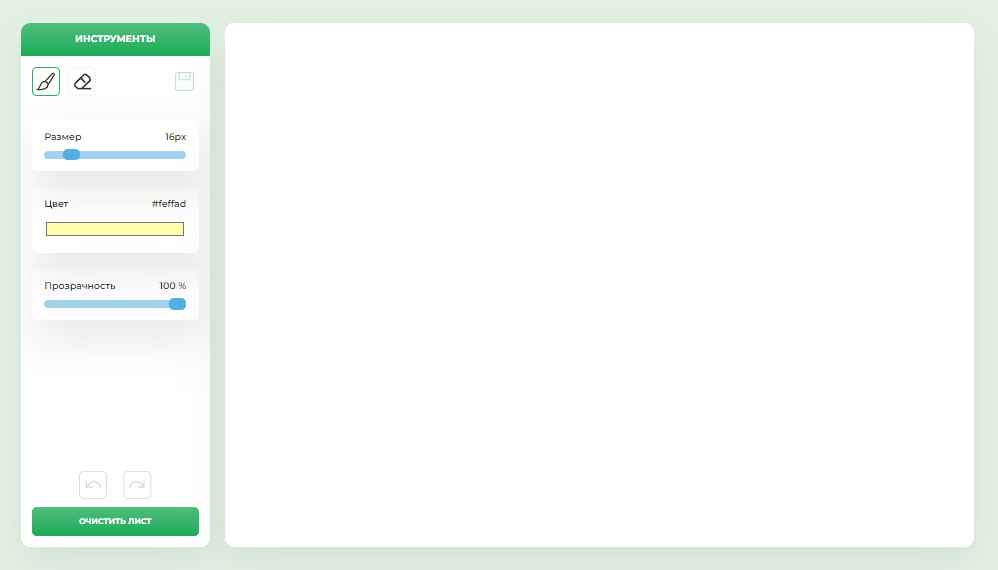

# "Drawing application"
Pet projects
#### [Посмотреть проект "Drawing application" в браузере](https://annakrasnovid.github.io/drawing-app/) 

## Описание:
**Drawing application** - это приложение для рисования, сделанное с помощью Canvas.

## Цель проекта:
Научиться работать с Canvas, изучить методы работы с ним.

## Функциональность:
* выбор инструментов для рисования (ластик, кисть)
* изменения цвета, толщины, прозрачности кисти
* ластик
* кнопки отмены и повтора действия
* очистка холста
* переключение опций в зависимости от инструмента
* сохранение рисунка

## Используемые технологии:
* HTML
* SCSS
* Canvas
* JavaScript
* Webpack

## Планы по доработке:
 Добавить новые инструменты для рисования: 
 * линии 
 * круги
 * квадраты
 * смена фона
 * смена темы

## Инструкция по установке:
Клонируем репозиторий:  
```
git clone https://github.com/AnnaKrasnovid/drawing-app.git
```  
Устанавливаем пакет зависимостей и webpack:  
```
npm i webpack --save-dev
```  
Запускаем проект на компьютере:  
```
npm run dev
```  

### Скриншот
</a>&nbsp;
